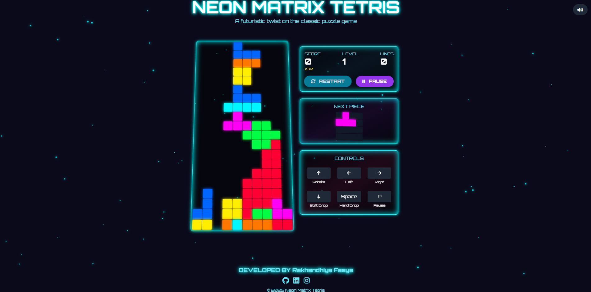

Here's a complete **README summary** for your GitHub repository, tailored for your project:

---

# 🎮 Neon Matrix Tetris

**Neon Matrix Tetris** is a feature-rich, visually immersive remake of the classic Tetris game — reimagined with futuristic neon visuals, glowing particle animations, and interactive sound & UI enhancements.

 <!-- Optional: Add a screenshot here if available -->

---

## 🚀 Features

* ✨ **Neon Visual Style** with glowing blocks and backgrounds
* 🎵 **8-bit Background Music** with toggleable sound control
* 👻 **Ghost Piece Preview** to aid strategic placement
* 🧠 **Dynamic Buff System** with power-ups like Speed Boost, Score Multiplier, and more
* 🔥 **Combo System** with multipliers and visual pop
* 🎉 **Level-Up Effects** with confetti and animated themes
* 🌌 **Animated Background** using custom particle canvas
* 📱 **Responsive Touch Controls** for mobile and desktop
* 🧩 **Tetromino Rotation, Hard Drop, and Soft Drop**
* 🧾 **Game Over Modal** with restart & quit options
* 🌈 **Dynamic Theme Switching** based on level

---

## 🕹 Controls

| Key/Button | Action          |
| ---------- | --------------- |
| ⬅️ / ➡️    | Move left/right |
| ⬆️         | Rotate piece    |
| ⬇️         | Soft drop       |
| Spacebar   | Hard drop       |
| P          | Pause/Resume    |
| Enter      | Start game      |

✅ Touch controls also included for mobile users!

---

## 📁 Folder Structure

```
index.html
sounds/
  └── 8bit-theme.mp3
assets/
  └── preview.png
```

---

## 🔊 Sound & Music

* Background music: `Lenny Pixels - The Beat of Nuts n Bolts (8-bit)`
* Sounds toggleable with the button in the top-right corner
* Uses HTML5 `<audio>` with JavaScript event control

---

## 📦 Tech Stack

* HTML5 + CSS3 + TailwindCSS
* JavaScript (Vanilla)
* Font Awesome for icons
* Google Fonts (Orbitron)
* No frameworks or libraries required — **just open `index.html` to play**

---

## 🧑‍💻 Developed By

**Rakhandhiya Fasya**
[GitHub](https://github.com/Rakhandhiyafa) • [LinkedIn](https://www.linkedin.com/in/rakhandhiya/) • [Instagram](https://www.instagram.com/rakhandhiyafa/)

---

## ✅ To Run the Game

1. Clone or download this repo
2. Open `index.html` in any modern web browser
3. Enjoy the neon-powered Tetris experience!

OR
Access this Link that i deployed: https://neon-matrix-tetris-rkhn.vercel.app/
---
